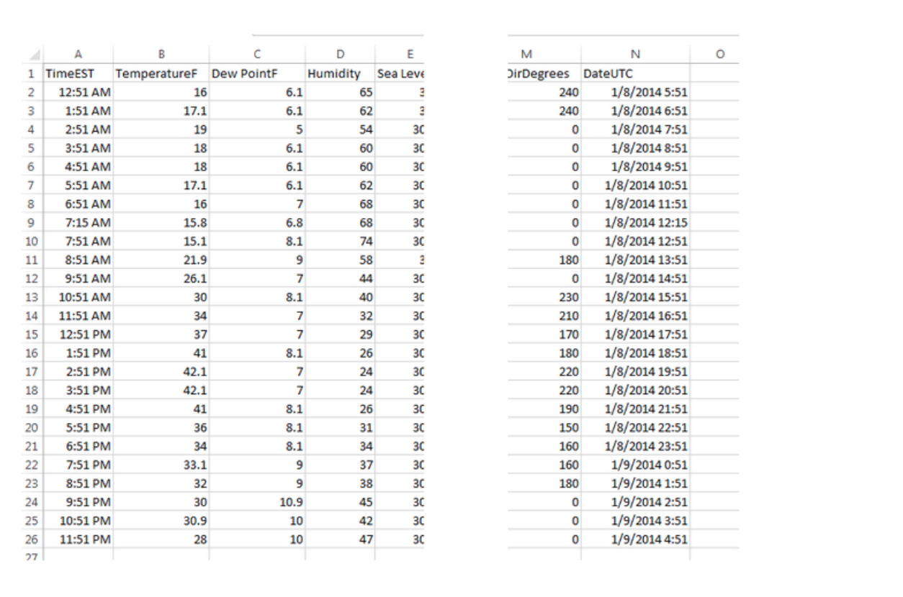

## Programming Exercise: Parsing Weather Data ☔

#### **`Assignment`**

You will write a program to find the coldest day of the year and other interesting facts about the temperature and humidity in a day. To test your program, you will use the `nc_weather` data folder that has a folder for each year; you can download a .zip folder with these files by clicking 
here. In the year folder there is a CSV file for every day of the year; each file has the following information. For example, in the 2014 folder, we show parts of the file weather-2014-01-08.csv, the weather data from January 8, 2014. 

You will write a program with several methods and  tester methods to test each method you write. You should start with the methods from the lesson to find the hottest temperature in a day (and thus in a file) and the hottest temperature in many files and their tester methods. You can use these to write similar methods to find the coldest temperatures.

---

 

### **Methods** :bookmark_tabs:

1. Write a method named `coldestHourInFile` that has one parameter, a `CSVParser named parser`. 
    * This method returns the CSVRecord with the coldest temperature in the file and thus all the information about the coldest temperature, such as the hour of the coldest temperature. 
    * You should also write a void method named `testColdestHourInFile()` to test this method and print out information about that coldest temperature, such as the time of its occurrence.

`NOTE`: Sometimes there was not a valid reading at a specific hour, so the temperature field says -9999. You should ignore these bogus temperature values when calculating the lowest temperature.